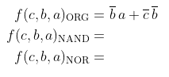
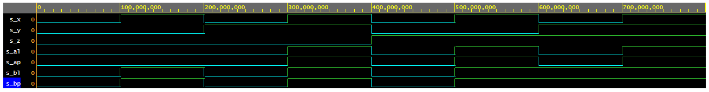

# Lab 1: NATALIE VYCHODILOVA

### De Morgan's laws zmena

1. Equations of all three versions of logic function f(c,b,a):

   

2. Listing of VHDL architecture from design file (`design.vhd`) for all three functions. Always use syntax highlighting, meaningful comments, and follow VHDL guidelines:

```vhdl
--morganovy zakony:
architecture dataflow of demorgan is
begin
    f_o      <= (not b_i and a_i) or (not c_i and not b_i);
    f_nand_o <= -- WRITE YOUR CODE HERE
    f_nor_o  <= -- WRITE YOUR CODE HERE
end architecture dataflow;

--distribucni zakony (design):
architecture dataflow of distributiveLaws is
begin
    aL_o  <= (x_i and y_i) or (x_i and z_i);
    aP_o  <= (x_i and (y_i or z_i));
    
    bL_o  <= ((x_i or y_i) and (x_i or z_i));
    bP_o  <= (x_i or (y_i and z_i));

end architecture dataflow;
```

3. Complete table with logic functions' values:

| **c** | **b** |**a** | **f(c,b,a)** | **f_NAND(c,b,a)** | **f_NOR(c,b,a)** | **f_1(z,y,x) left** | **f_1(z,y,x) right** | **f_2(z,y,x) left** | **f_2(z,y,x) right** |
| :-: | :-: | :-: | :-: | :-: | :-: | :-: | :-: | :-: | :-: |
| 0 | 0 | 0 | 1 | 1 | 1 | 0 | 0 | 0 | 0 |
| 0 | 0 | 1 | 1 | 1 | 1 | 0 | 0 | 1 | 1 |
| 0 | 1 | 0 | 0 | 0 | 0 | 0 | 0 | 0 | 0 |
| 0 | 1 | 1 | 0 | 0 | 0 | 1 | 1 | 1 | 1 |
| 1 | 0 | 0 | 0 | 0 | 0 | 0 | 0 | 0 | 0 |
| 1 | 0 | 1 | 1 | 1 | 1 | 1 | 1 | 1 | 1 |
| 1 | 1 | 0 | 0 | 0 | 0 | 0 | 0 | 1 | 1 |
| 1 | 1 | 1 | 0 | 0 | 0 | 1 | 1 | 1 | 1 |

### Distributive laws

1. Screenshot with simulated time waveforms. Always display all inputs and outputs (display the inputs at the top of the image, the outputs below them) at the appropriate time scale!

   

2. Link to your public EDA Playground example:

   [https://www.edaplayground.com/x/Nwbb](https://www.edaplayground.com/x/Nwbb)
