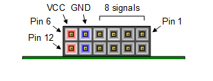
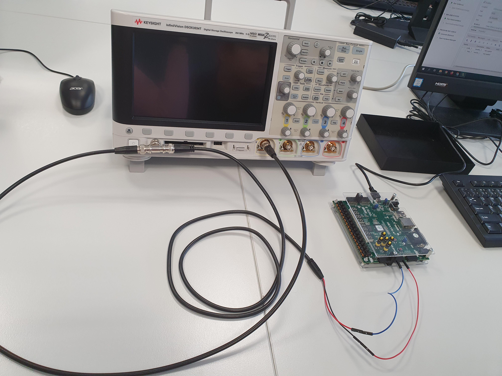
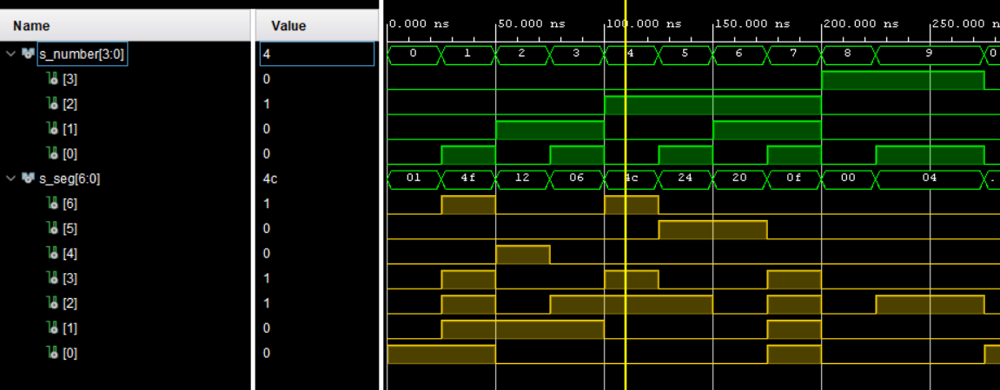
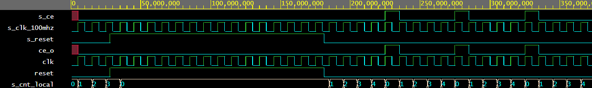
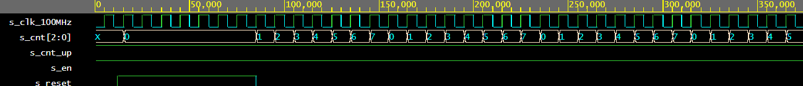
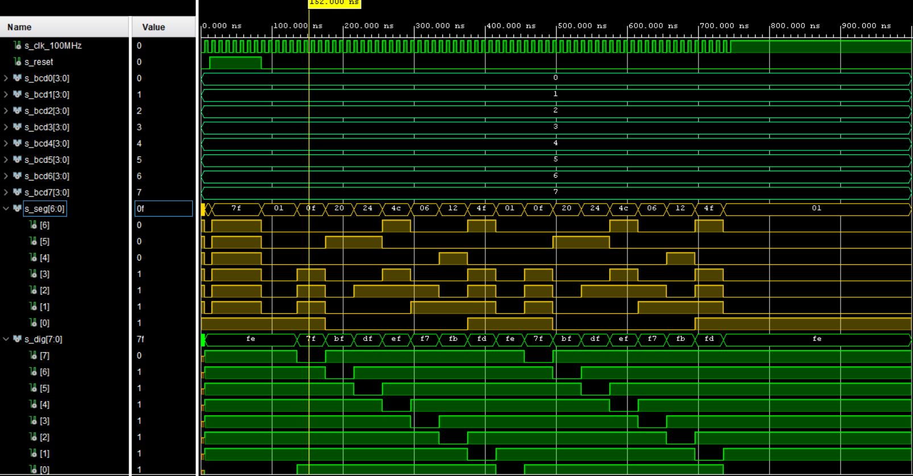
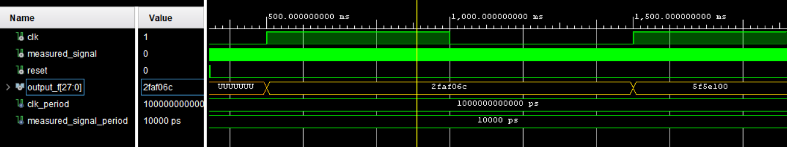
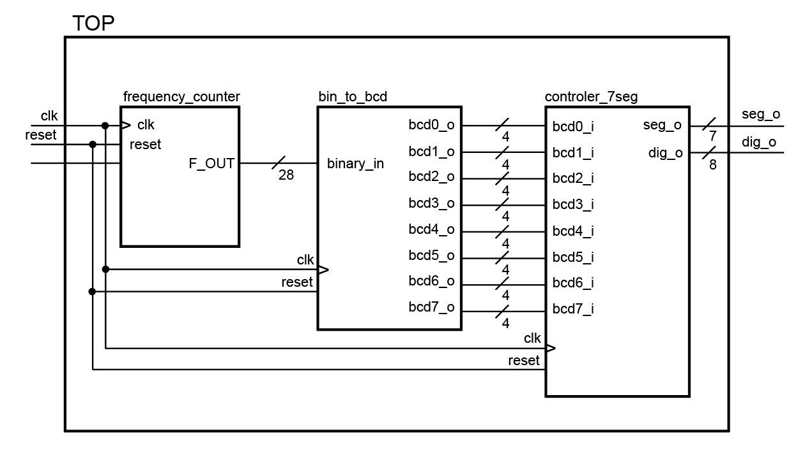

# FREQUENCY COUNTER OF SQUARE AND HARMONIC SIGNAL
### Team members

* Natalie Vychodilova (Responsible for creating design sources: 
binary to bcd converter, controller for 8 digits, hex to segment. 
Responsible for creating testbenches for all designs, simulation all sources. Creating schematics and documentation.)

* Monika Vlkova (Responsible for video and hardware desctription)

* Peto Kondas (Responsible for creating constrains and Hardware description)

* Radek Vomocil (Responsible for creating design source frequency counter, creating testbench file & clock divider)

Link to our GitHub project folder:
   [https://github.com/...]()


### Table of contents
* [Project objectives](#objectives)
* [Hardware description](#hardware)
* [VHDL modules description and simulations](#modules)
* [TOP module description and simulations](#top)
* [Video](#video)
* [References](#references)


<a name="objectives"></a>
## Project objectives
Cílem projektu bylo vytvořit čítač frekvence pro harmonický a obdélníkový signál. 
Celý projekt byl rozdělen na dílčí části, které se věnovaly řešení jednotlivých bloků 
celého kódu. Cílem bylo vhodně navrhnout řešení a až teprve potom tyto bloky implementovat. 
Implementace probíhala ve vývojovém prostředí Vivado verze 2020.2 a výsledný kód byl 
nahráván na desku Nexys A7-50T. K otestování signálu byl k dispozici osciloskop Keysight DSOX3034T.
Řešení tohoto projektu vychází z probírané látky předmětu BPC-DE1.


<a name="hardware"></a>
## Hardware description
Jako generátor signálu jsme použili osciloskop Keysight DSOX3034T, jehož výstup jsme pomocí 
bc kabelu připojili na Pmod Headrr JA desky Nexys A7-50T. Uspořádání pinů Pmod headru je 
zobrazeno na obrázku č. 1.    
* *Obrázek 1. Pmod Porty*

Signál osciloskopu jsme připojili na pin 1 a uzemnění na gND pin.
* *Obrázek 2. zapojení pracoviště*


<a name="modules"></a>
## VHDL modules description and simulations
V tomto bloku jsou vysvětleny jednotlivé moduly. Uvedena je vždy část kódu, popis modulu a 
simulace daného design souboru. 


### Modul *number_7seg.vhd*
Tento modul překládá číslice 0-9. Vstup má 4 bity (protože pro zobrazení 10 číslic je 
potřeba 2^4 možností). Vstupní hodnoty jsou převedeny na 7 bitový výstup, 
který se následně zobrazuje na 7 segmentovém display. 

```vhdl
entity number_7seg is
    Port ( number_i : in STD_LOGIC_VECTOR (3 downto 0);
           seg_o : out STD_LOGIC_VECTOR (6 downto 0));
end number_7seg;
```
* Pravdivostní tabulka pro kombinace na vstupu 0-9. Pokud je na vstupu jiná kombinace, než číslice
0-9 nic se nezobrazí.

| Number |  Input  |  A  |  B  |  C  |  D  |  E  |  F  |  G  |
|:------:|:-------:|:---:|:---:|:---:|:---:|:---:|:---:|:---:|
| 0        |0000       |     0 |     0 |     0 |     0 |     0 |     0 |     1 |
| 1 |0001| 1 | 0 | 0 | 1 | 1 | 1 | 1 |
| 2 |0010| 0 | 0 | 1 | 0 | 0 | 1 | 0 |
| 3 |0011| 0 | 0 | 0 | 0 | 1 | 1 | 0 |
| 4 |0100| 1 | 0 | 0 | 1 | 1 | 0 | 0 |
| 5 |0101| 0 | 1 | 0 | 0 | 1 | 0 | 0 |
| 6 |0110| 0 | 1 | 0 | 0 | 0 | 0 | 0 |
| 7 |0111| 0 | 0 | 0 | 1 | 1 | 1 | 1 |
| 8 |1000| 0 | 0 | 0 | 0 | 0 | 0 | 0 |
| 9 |1001| 0 | 0 | 0 | 0 | 1 | 0 | 0 |

* Simulace modulu number_7seg.vhd (soubor tb_number_7seg.vhd)


### Modul *clock_enable.vhd*
Modul posílá puls každých g_MAX pulsů hlavního bloku. Modul je použit v design 
souboru *control_7seg.vhd*
```vhdl
entity clock_enable is
    generic(
        g_MAX : natural := 10  -- Number of clk pulses to
                               -- generate one enable signal
                               -- period
    );  -- Note that there IS a semicolon between generic 
        -- and port sections
    port(
        clk   : in  std_logic; -- Main clock
        reset : in  std_logic; -- Synchronous reset
        ce_o  : out std_logic  -- Clock enable pulse signal
    );
end entity clock_enable;
```
* Simulace modulu clock_enable.vhd


### Modul *cnt_up_down.vhd*
Modul počítá hodinové pulsy až do defaultně nastavené hodnoty. Umožňuje čítat 
jak nahoru, tak i dolů (záleží na cnt_up)
```vhdl
entity cnt_up_down is
    generic(
        g_CNT_WIDTH : natural := 4 -- Number of bits for counter
    );
    port(
        clk      : in  std_logic;  -- Main clock
        reset    : in  std_logic;  -- Synchronous reset
        en_i     : in  std_logic;  -- Enable input
        cnt_up_i : in  std_logic;  -- Direction of the counter
        cnt_o    : out std_logic_vector(g_CNT_WIDTH - 1 downto 0)
    );
end entity cnt_up_down;
```
* Simulace modulu cnt_up_down.vhd


### Modul *controler_7seg.vhd*
Na vstupu tohoto modulu je osm vstupů z nichž je každý 4 bitový.
Vstup udává binární hodnotu číslice určené pro každý digit (1-8 segmentů).

```vhdl
entity controler_7seg is
    port(
        clk     : in  std_logic;
        reset   : in  std_logic;
        
        bcd0_i : in  std_logic_vector(3 downto 0);
        bcd1_i : in  std_logic_vector(3 downto 0);
        bcd2_i : in  std_logic_vector(3 downto 0);
        bcd3_i : in  std_logic_vector(3 downto 0);
        bcd4_i : in  std_logic_vector(3 downto 0);
        bcd5_i : in  std_logic_vector(3 downto 0);
        bcd6_i : in  std_logic_vector(3 downto 0);
        bcd7_i : in  std_logic_vector(3 downto 0);
        
        seg_o   : out std_logic_vector(6 downto 0);
        dig_o   : out std_logic_vector(7 downto 0)
    );
end entity controler_7seg;
```
* Simulace modulu controler_7seg.vhd


### Modul *bin_to_bcd.vhd*
Modul umožňuje převod binárního čísla o maximální délce 2^28 bitů na 8 BCD hodnot. 
Tato hodnota je na vstup modulu přivedena z frekvenčního čítače. 
V registru dojde k rozdělení těchto 28 bitů na 8 4-bitových vektorů, které jsou následně
předány modulu *controler_7seg.vhd*

```vhdl
entity bin_to_bcd is
    port(
        clk : in std_logic; 
        reset: in std_logic;
        binary_in: in std_logic_vector(28-1 downto 0);
        
        bcd0_o : out std_logic_vector(3 downto 0);
        bcd1_o : out std_logic_vector(3 downto 0);
        bcd2_o : out std_logic_vector(3 downto 0);
        bcd3_o : out std_logic_vector(3 downto 0);
        bcd4_o : out std_logic_vector(3 downto 0);
        bcd5_o : out std_logic_vector(3 downto 0);
        bcd6_o : out std_logic_vector(3 downto 0);
        bcd7_o : out std_logic_vector(3 downto 0)
    );
end bin_to_bcd ;
```
* Simulace modulu bin_to_bcd.vhd


### Modul *frequency_counter.vhd*
V modulu frequency_counter čítáme rising edge vstupního signálu, dokud nepřijde rising edge hodin.
Vstupy tohoto modulu jsou frekvence hodin, měřený signál a reset. Jako výstup máme 27 bitovou frekvenci (2^27 pro zobrazení číslic na všech 8 pozicích) 
```vhdl
entity frequency_counter is
    port (
        HZ_CLK     : in std_logic;
        -- measured signal
        M_SIGNAL    : in std_logic;
        RESET       : in std_logic;
        -- max measured value can be 2^16 - 1 => 65535, change the width of the output signal if needed
        F_OUT       : out std_logic_vector(27 downto 0)
    );
end frequency_counter;
```


<a name="top"></a>
## TOP module description
Modul *top.vhd* obsahuje všechny moduly. Jsou zde definovány vstupy a výstupy
desky Nexys A7-50T. Top má celkem tři vstupy: hodinový signál desky, měřený signál
a resetovací tlačítko. Výstupy jsou jednotlivé katody a anody, které jsou aktivovány 
pro všechny segmenty na desce.

```vhdl
entity top is
    Port ( 
        -- clock, measured signal and reset button
        CLK100MHz : in STD_LOGIC;
        M_SIGNAL : in STD_LOGIC;
        BTNC : in STD_LOGIC;
        
        --outputs (all segments and all anodes (8 digits))
        CA : out STD_LOGIC;
        CB : out STD_LOGIC;
        CC : out STD_LOGIC;
        CD : out STD_LOGIC;
        CE : out STD_LOGIC;
        CF : out STD_LOGIC;
        CG : out STD_LOGIC;
        DP : out STD_LOGIC;
        AN : out std_logic_vector(7 downto 0)
     );
end entity top;
```
* Schéma modulu top.vhd



<a name="video"></a>
## Video
* [odkaz na video](https://youtu.be/ZYKn0piK8Zw)


<a name="references"></a>
## References
* [Schematics](https://digilent.com/reference/_media/programmable-logic/nexys-a7/nexys-a7-d3-sch.pdf)
* [Nexys A7 Reference Manual](https://digilent.com/reference/programmable-logic/nexys-a7/reference-manual?redirect=1)
